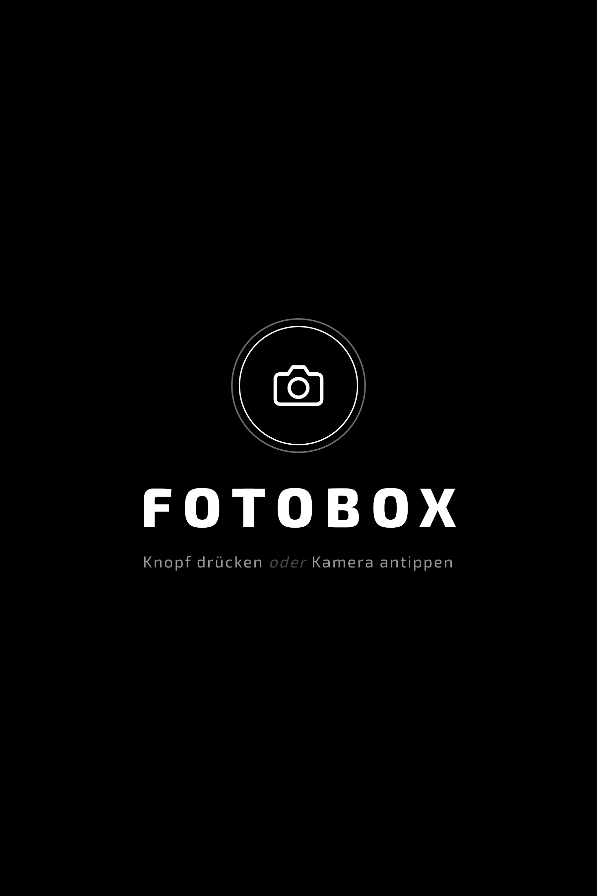
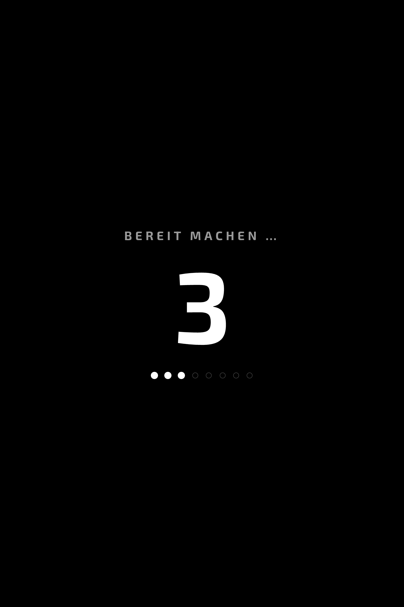
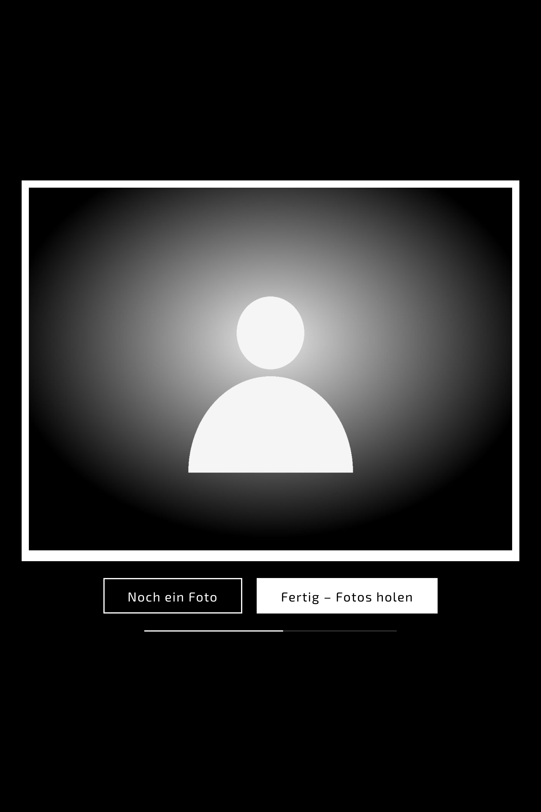
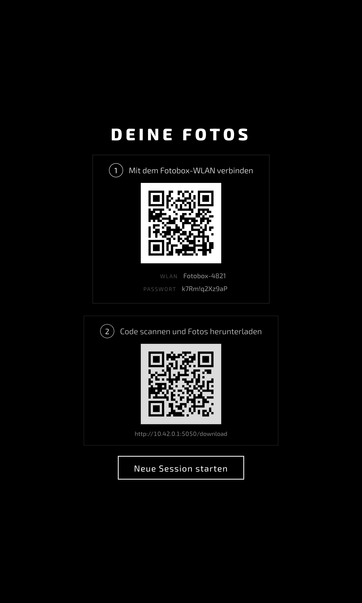
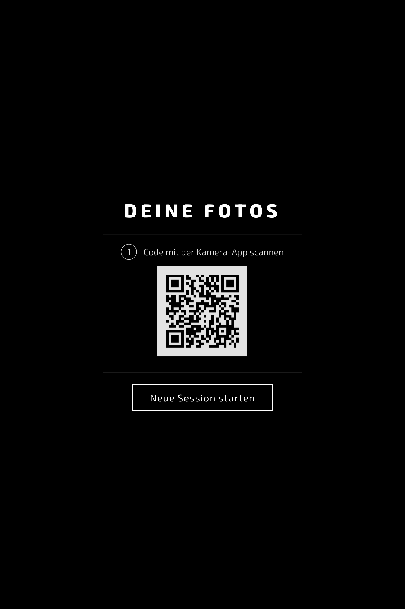
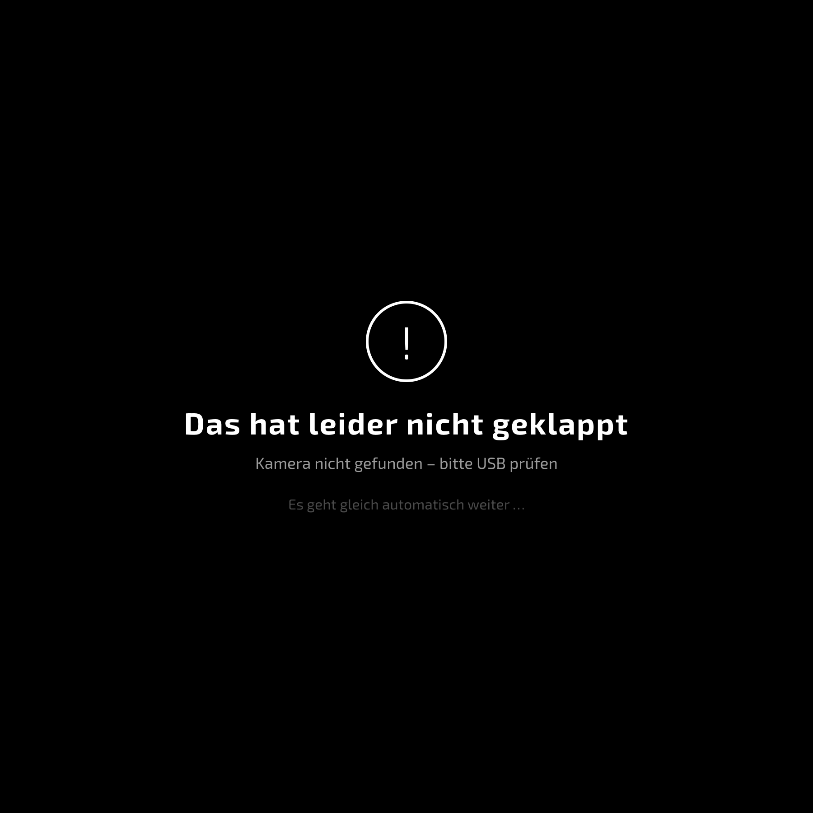
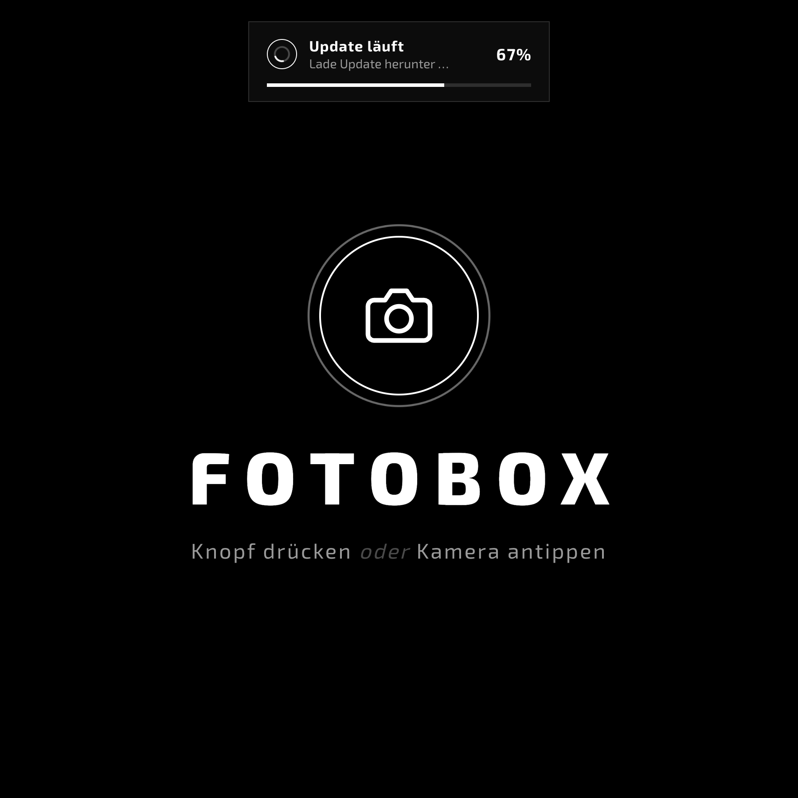
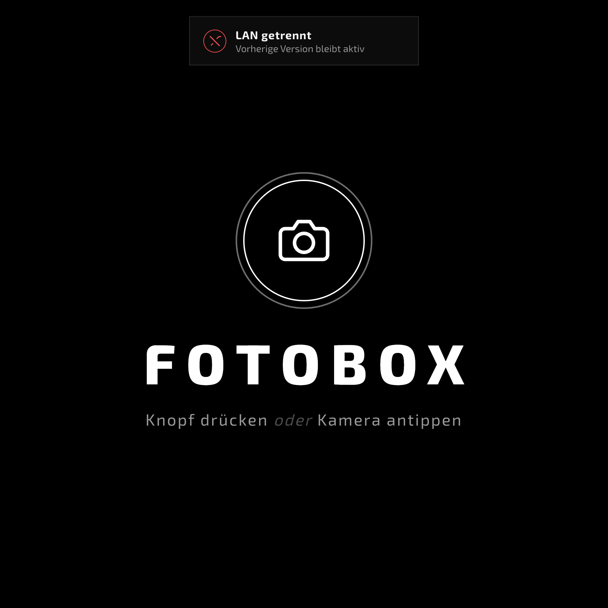
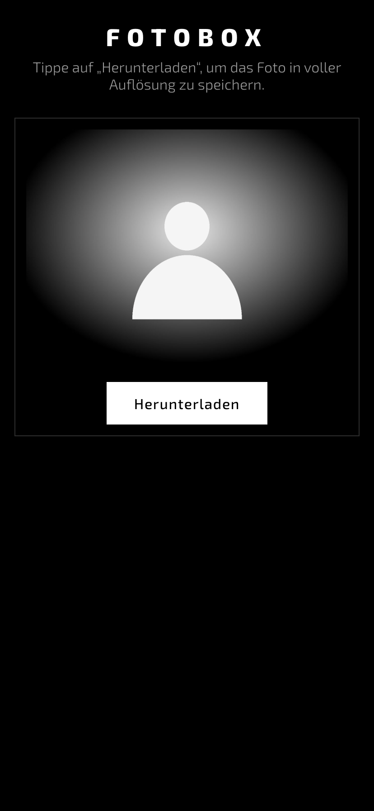

<div align="center">

# 📸 FOTOBOX GREAT!!!

**Eine DSLR-Photobox auf dem Raspberry Pi – Knopfdruck, Countdown, Foto, fertig.**

Schwarz-weißes Kiosk-Interface · WLAN- oder Nextcloud-Sharing · Auto-Update über LAN · komplett ohne Maus & Tastatur bedienbar.



</div>

---

## ✨ Highlights

- **🎛️ Ein-Knopf-Bedienung** – physischer Arduino-Button *oder* Touch auf dem Display.
- **⏱️ Animierter Countdown** mit Sekundenzahl, Punkten und Blitz-Effekt bei der Aufnahme.
- **🖼️ Sofort-Vorschau** – heruntergerechnete Previews statt 20-MP-JPEGs, damit der Pi 3 flüssig bleibt.
- **📤 Zwei Sharing-Wege:** lokaler **WLAN-Hotspot** mit Download-Galerie *oder* **Nextcloud**-Upload mit öffentlichem Link.
- **🔲 QR-Codes nacheinander** als nummerierte Schritte – nichts mehr zum Rätseln.
- **🔄 Auto-Update über Ethernet:** Kabel rein → die Box zieht automatisch die neueste Version, inkl. **Live-Fortschrittsbalken** und Toast-Benachrichtigung. Kabel raus → sauberer Rollback, alte Version bleibt aktiv.
- **🎨 Monochromes Design** in **Exo 2** (lokal gebündelt, offline-tauglich), GPU-schonende Animationen.
- **🔒 Sicher by default:** Steuer-Endpoints nur über localhost, CSPRNG-Secrets, Timeouts überall.
- **✅ 99 Tests**, komplett ohne Hardware lauffähig.

---

## 🖥️ Die Oberfläche

| Idle | Countdown | Review |
|:---:|:---:|:---:|
|  |  |  |
| Startbildschirm mit pulsierendem Auslöser | Countdown mit Zahl & Punkten | Foto im Print-Rahmen, Auto-Reset-Leiste |

| Sharing · Hotspot | Sharing · Nextcloud | Fehler |
|:---:|:---:|:---:|
|  |  |  |
| WLAN-QR + Download-QR als Schritte | Ein QR zum Cloud-Link | Klare, freundliche Fehlermeldung |

### Auto-Update & Benachrichtigungen

| LAN verbunden – Update mit Fortschritt | LAN getrennt – Rollback |
|:---:|:---:|
|  |  |

### Gäste-Download (Smartphone)

<div align="center">

</div>

> Die Screenshots werden mit [`docs/make_screenshots.py`](docs/make_screenshots.py) automatisch aus der echten laufenden App erzeugt.

---

## 🔌 Hardware

| Komponente | Anschluss | Zweck |
|---|---|---|
| Canon DSLR | USB → Raspberry Pi | Aufnahme via gphoto2 |
| HDMI-Display | HDMI → Raspberry Pi | Kiosk-UI |
| Auslöse-Button | Digital-Pin → Arduino Nano | Physischer Auslöser |
| LED-Ring (WS2812) | Digital-Pin → Arduino Nano | Visueller Countdown |
| Arduino Nano | USB → Raspberry Pi | Serielle Brücke |

---

## 🔄 Ablauf

```
   Idle ──[Button/Touch]──► Countdown ──[countdown_complete]──► Capture
    ▲                                                              │
    │                                                              ▼
    └──────[Neue Session]──── QR/Sharing ◄──[Fertig]──── Review (Foto)
```

1. **Idle** – Startbildschirm, LED-Ring pulst.
2. **Countdown** – Arduino zählt über den LED-Ring herunter, das Display zeigt Zahl + Punkte, dann kommt `countdown_complete` über Serial.
3. **Capture** – der Pi löst die Kamera über gphoto2 aus und lädt das Bild herunter.
4. **Review** – downskalierte Vorschau; „Noch ein Foto" oder „Fertig".
5. **Sharing** – je nach `FOTOBOX_SHARE_MODE`:
   - `hotspot`: WLAN-AP hoch, zwei QR-Codes (WLAN beitreten → Galerie öffnen).
   - `nextcloud`: Hintergrund-Upload + öffentlicher Share-Link als ein QR.

**Parallel dazu** beobachtet ein Thread den Ethernet-Port: Kabel rein → `git`-Auto-Update mit Toast & Fortschrittsbalken; Kabel raus → laufendes Update wird abgebrochen und zurückgerollt.

---

## 🚀 Schnellstart

### 1. Systempakete (Raspberry Pi)

```bash
sudo apt-get update
sudo apt-get install -y gphoto2 libgphoto2-dev python3-pip python3-venv
```

### 2. Projekt einrichten

```bash
cd ~/Fotobox
python3 -m venv venv
source venv/bin/activate
pip install -r requirements.txt
cp .env.example .env      # anschließend anpassen
```

### 3. Arduino-Firmware

`arduino/fotobox_trigger/fotobox_trigger.ino` in der Arduino-IDE öffnen und auf den Nano flashen.

### 4. Server starten

```bash
source venv/bin/activate
python -m server.app
```

UI: `http://localhost:5000`
*(macOS-Hinweis: Port 5000 ist von AirPlay belegt → `FOTOBOX_PORT=5050`.)*

### 5. Kiosk **ohne Desktop** (empfohlen auf dem Pi 3)

Spart ~150–250 MB RAM und mehrere Sekunden Boot – es läuft nur X-Server + Chromium, keine Desktop-Umgebung:

```bash
# Boot auf Konsole stellen
sudo raspi-config   # System Options → Boot / Auto Login → Console Autologin

# Minimales X + Chromium
sudo apt-get install -y xserver-xorg xinit chromium-browser

# Kiosk-Service aktivieren
sudo cp fotobox-kiosk.service /etc/systemd/system/
sudo systemctl daemon-reload
sudo systemctl enable --now fotobox-kiosk.service
```

`setup.sh` erledigt Schritte 1–2, installiert beide systemd-Services und legt die `.env` an.

---

## ⚙️ Konfiguration

Alles kommt aus Umgebungsvariablen bzw. der `.env` (siehe [`.env.example`](.env.example)):

| Variable | Default | Zweck |
|---|---|---|
| `FOTOBOX_SHARE_MODE` | `nextcloud` | `hotspot` oder `nextcloud` |
| `FOTOBOX_NC_URL` / `_USER` / `_PASS` | – | Nextcloud-Zugang (**App-Passwort!**) |
| `FOTOBOX_NC_FOLDER` | `Fotobox` | Basisordner in Nextcloud |
| `FOTOBOX_NC_TIMEOUT` | `10` | Timeout (s) für Nextcloud-API |
| `FOTOBOX_PHOTO_DIR` | `~/photos` | Lokaler Foto-Speicher |
| `FOTOBOX_SERIAL_PORT` | `/dev/ttyUSB0` | Arduino-Device |
| `FOTOBOX_AUTO_UPDATE` | `1` | Auto-Update beim LAN-Einstecken |
| `FOTOBOX_ETH_IFACE` | `eth0` | Überwachtes Ethernet-Interface |
| `FOTOBOX_ALLOW_REMOTE_CONTROL` | `0` | Steuer-Endpoints auch extern erlauben (nur Dev!) |
| `FOTOBOX_REVIEW_SECONDS` | `30` | Auto-Reset des Review-Screens (0 = aus) |
| `FOTOBOX_QR_TIMEOUT_SECONDS` | `120` | Auto-Reset des QR-Screens (0 = aus) |
| `FOTOBOX_PREVIEW_MAX_SIZE` | `1280` | Max. Kantenlänge der Vorschaubilder |

---

## 🔒 Sicherheit

- **Steuer-Endpoints** (`/`, `/events`, `/trigger`, `/session/*`) sind nur über `localhost` erreichbar. Gäste im Hotspot sehen ausschließlich `/download` und `/photos/*`.
- **Secrets** (Hotspot-Passwort, Nextcloud-Session-IDs) kommen aus dem `secrets`-Modul (CSPRNG), nicht aus `random`.
- **Timeouts** auf allen Netzwerk-Calls – eine nicht erreichbare Cloud friert die UI nicht ein, sondern liefert einen sauberen 503 und legt die Fotos in die Session zurück.
- Nextcloud bitte mit **App-Passwort** betreiben. Zugangsdaten gehören in die `.env` (per `.gitignore` ausgeschlossen).

---

## 🧱 Architektur

```
server/
├── app.py              # Flask + SSE-Statemachine + Session/Sharing + Ethernet-Hooks
├── camera.py           # gphoto2-Aufnahme
├── serial_reader.py    # Arduino-Serial (Daemon-Thread, optional)
├── access_point.py     # nmcli-Hotspot mit Profil-Wiederverwendung
├── nextcloud_client.py # WebDAV-Upload + OCS-Share-Links (mit Timeouts)
├── previews.py         # gecachte, heruntergerechnete Vorschaubilder
├── network_monitor.py  # Ethernet-Carrier-Überwachung
├── updater.py          # git-Selbstupdate mit echtem Fortschritt & Rollback
├── config.py           # Konfiguration aus .env
├── static/             # style.css, app.js, fonts/ (Exo 2)
└── templates/          # index.html (Kiosk), download.html (Gäste)
```

**Event-Fluss:** Arduino → `SerialReader` → `_on_serial_message()` → `event_queue` → `/events` (SSE) → `app.js`-Statemachine (5 Screens). Ethernet-Events und Update-Fortschritt laufen über denselben SSE-Kanal in den Toast.

**Performance (Pi 3):** Kiosk ohne Desktop · gecachte Previews · nmcli-Profil-Reuse · Animationen nur über `transform`/`opacity`.

---

## 🧪 Tests

```bash
source venv/bin/activate
pytest                  # 99 Tests, keine Hardware nötig
pytest tests/test_updater.py -v
```

Alle Hardware-/Netzwerkzugriffe sind gemockt (Kamera, Serial, nmcli, Nextcloud, git, Ethernet-Carrier). Gemeinsame Fixtures liegen in `tests/conftest.py`.

---

## 📁 Projektstruktur

```
├── arduino/fotobox_trigger/   # Arduino-Firmware
├── server/                    # Flask-App (siehe Architektur)
├── tests/                     # pytest-Suite
├── docs/screenshots/          # README-Screenshots (auto-generiert)
├── kiosk.sh                   # Chromium-Kiosk ohne Desktop
├── fotobox.service            # systemd: Flask-Server
├── fotobox-kiosk.service      # systemd: Kiosk-Browser (xinit)
├── setup.sh                   # Einrichtung
└── .env.example               # Konfigurationsvorlage
```

---

## 📜 Lizenz

Apache 2.0 – siehe [LICENSE](LICENSE).
